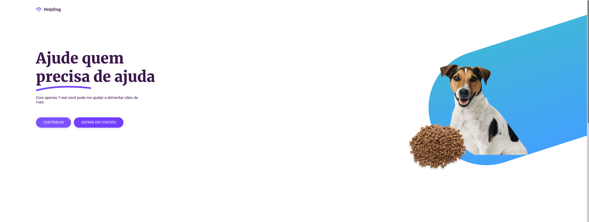

<h1 align="center"> HelpDog 🐶</h1>
<p align="center">
  
</p>

## 💻 Projeto

O protótipo desse website foi desenvolvido pelo [**Iuri Silva**](https://www.iuricode.com/), [clique aqui](https://www.figma.com/file/Yb9IBH56g7T1hdIyZ3BMNO/Desafios---Codel%C3%A2ndia?node-id=39936%3A781) para abrir o protótipo no figma.

Dependências usadas no projeto:

-  [Next.js](https://nextjs.org/)
-  [Sass](https://sass-lang.com/)
-  [TypeScript](https://www.typescriptlang.org/)
-  [React Icons](https://react-icons.netlify.com/)

Também foram adicionados as ferramentas [**ESLint**](https://eslint.org/) e [**Prettier**](https://prettier.io/) para aumentar a produtividade e auxiliar a manter um padrão de código.

## 📥 Instalação e execução

Faça um clone desse repositório e acesse o diretório.

```bash/zsh
# Instalando as dependências
$ yarn

# Executanto aplicação
$ yarn next
```
